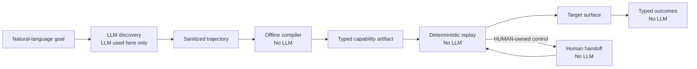

# Deterministic computer-use automation for a legacy portal

This reference system accepts a natural-language goal, lets an LLM discover the browser workflow
once, and compiles the successful trajectory into a typed, versioned capability artifact. Later
executions replay that artifact deterministically with zero model calls. HUMAN-owned and
irreversible controls are never automated. The submitted `prepare_savings_subaccount` capability
prepares a savings-subaccount request in a synthetic credit-union portal and stops at the verified
review screen without opening the account.

## Architecture at a glance



Playwright is private behind `SurfaceAdapter`; neither discovery nor replay receives a browser,
page, selector, or arbitrary-code primitive.

## What is implemented

| Capability           | Implementation                                                                                                                  |
| -------------------- | ------------------------------------------------------------------------------------------------------------------------------- |
| LLM discovery        | One OpenAI Agents SDK agent observes semantic UI state and chooses from six bounded tools.                                      |
| Typed artifact       | A schema-validated, canonical JSON capability with version, lifecycle, inputs, outputs, steps, policy, and provenance.          |
| Deterministic replay | Ordered execution through `SurfaceAdapter`, with no model call and no autonomous discovery fallback.                            |
| Business outcome     | `MEMBER_NOT_FOUND` is a declared terminal outcome, distinct from automation failure.                                            |
| Timeout and retry    | Aggregate and per-step deadlines; retries only for declared idempotent fills/selections and named recoverable conditions.       |
| Safety policy        | Allowlists plus ownership and risk checks block HUMAN, NONE, external, ambiguous, and irreversible actions.                     |
| Human handoff        | Same-session pause/resume with a bound checkpoint, single-use in-memory token, TTL, and fresh observation.                      |
| Redacted evidence    | Structured events, summaries, hashes, and masked screenshots without credentials, resolved inputs, tokens, or model transcript. |

## Prerequisites and local setup

- Node.js 20 or newer
- npm
- Playwright Chromium for browser demos

```powershell
npm ci
npx playwright install chromium
Copy-Item .env.example .env
```

Normal replay and handoff need only these `.env` values:

```dotenv
TARGET_BASE_URL=http://localhost:3000
PORTAL_PASSWORD=creditunion-demo
```

`OPENAI_API_KEY` and `OPENAI_MODEL` are required only for a new discovery run. They are not required
for deterministic replay or handoff. `.env` is ignored by Git and must never be committed.

## Five-minute zero-model demo

This demo does not call OpenAI.

**Terminal 1 — start the portal and leave it open**

```powershell
npm run target:start
```

The command always selects the normal scenario, even if the shell inherited an old scenario value.
Wait for startup output containing:

```text
scenario: normal
```

**Terminal 2 — choose exactly one replay command**

Headless:

```powershell
npm run replay:prepare:demo
```

Visible browser:

```powershell
npm run replay:prepare:demo:headed
```

These are alternatives; you do not need to run both. In visible mode the browser:

1. logs in;
2. searches for the synthetic member;
3. opens **Add Savings**;
4. fills the request;
5. reaches **Review Savings Subaccount**;
6. never clicks **Open Account**; and
7. closes automatically after success.

Automatic closure means replay reached its terminal checkpoint and released the browser session; it
is not a crash. Expected terminal output includes:

```text
"status":"success"
```

The demo scripts contain an explicit local `--allow-draft` override. Default and production
`ReplayEngine` behavior still rejects DRAFT artifacts.

## Structured capability artifact

The reviewable deliverables are the
[`prepare_savings_subaccount` v1.0.0 artifact](artifacts/prepare_savings_subaccount/1.0.0/capability.json)
and its [JSON schema](schemas/capability-artifact.v1.schema.json).

| Included                                                            | Deliberately excluded                            |
| ------------------------------------------------------------------- | ------------------------------------------------ |
| Identity, semantic version, DRAFT lifecycle, and `approvalRequired` | Raw model transcript                             |
| Typed inputs and typed outputs                                      | CSS/XPath selectors                              |
| Twelve ordered steps and semantic target recipes                    | Observation IDs and temporary element references |
| Preconditions, expected page states, and success checkpoint         | Credentials and resolved invocation values       |
| Per-step timeouts and bounded retry policy                          | Browser or Playwright handles                    |
| Business outcomes plus ownership and risk requirements              | Provider messages and arbitrary executable code  |

The offline compiler emits DRAFT artifacts. Approval is required before normal replay; the local
demo override is explicit and does not approve or modify the artifact.

## Where the LLM is used

The authoritative discovery run is `discovery-20260920160150-78f495af`. The OpenAI Agents SDK was
used only during discovery: the model received the natural-language goal and sanitized semantic
observations, selected bounded click/fill/select/navigation tools, completed the workflow, and
stopped at `ready-for-review`. Deterministic code then compiled that successful trajectory offline.
Compilation, replay, business-outcome handling, and handoff make zero model calls.

Running discovery again is optional, makes a live OpenAI request, consumes API usage, and requires
the local portal plus the discovery-specific environment values:

```powershell
npm run discover:prepare:headed
```

## Human-handoff demo

Stop any normal portal first.

**Terminal 1**

```powershell
npm run target:start:handoff
```

Wait for startup output containing:

```text
scenario: identity_verification_on_review
```

**Terminal 2**

```powershell
npm run replay:prepare:handoff
```

The flow is:

1. Replay performs the automation-owned steps.
2. It pauses at **Identity Verification Required**.
3. In the synthetic browser, enter `739241`.
4. Click **Verify and continue**.
5. Wait until **Review Savings Subaccount** is visible.
6. Return to Terminal 2 and press Enter on an empty line.
7. Replay freshly observes the same browser session, validates the checkpoint, and exits
   successfully.

A wrong code leaves the browser on the verification page with a visible error. Correct it and retry
in the browser. Do not press Enter until the review page appears. Pressing Enter early cannot
produce success: replay detects the persistent HUMAN gate as `HANDOFF_NOT_COMPLETED` and continues
waiting within the handoff TTL.

`739241` is synthetic local fixture data. A real verification secret would arrive through an
out-of-band human channel; automation does not resolve, enter, log, or persist it.

## Optional business-outcome demo

With the normal portal running, use a missing synthetic member and then clear the temporary value:

```powershell
$env:REPLAY_MEMBER_ID = "M-99999"
npm run replay:prepare:demo:headed
Remove-Item Env:REPLAY_MEMBER_ID -ErrorAction SilentlyContinue
```

The terminal result is the declared `MEMBER_NOT_FOUND` business outcome, not a generic crash.

## Evidence and repository map

Curated, redacted evidence is tracked for the
[LLM discovery trajectory](evidence/examples/discovery/trajectory.json),
[successful replay](evidence/examples/replay-success/summary.json),
[same-session handoff](evidence/examples/replay-handoff/summary.json), and
[`MEMBER_NOT_FOUND` outcome](evidence/examples/replay-business-outcome/summary.json). The
[manifest](evidence/examples/manifest.json) pins every curated file by size and SHA-256. Runtime
evidence under `evidence/discovery/` and `evidence/replay/` remains ignored. See
[`REPORT.md`](REPORT.md) for design decisions and tradeoffs.

- `target_app/` — local Express/EJS legacy portal with synthetic fixtures
- `src/browser/` — bounded Playwright `SurfaceAdapter`
- `src/discovery/` — single-agent discovery boundary
- `src/compiler/` and `schemas/` — offline compiler and artifact contract
- `src/replay/`, `src/handoff/`, `src/policy/` — deterministic execution and safety controls
- `artifacts/` — canonical versioned capability
- `evidence/examples/` — curated submission evidence
- `tests/` — unit, integration, and browser end-to-end coverage

## Validation

```powershell
npm run format
npm run lint
npm run typecheck
npm test
npm run build
npm run test:e2e
git diff --check
```
