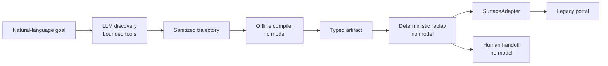
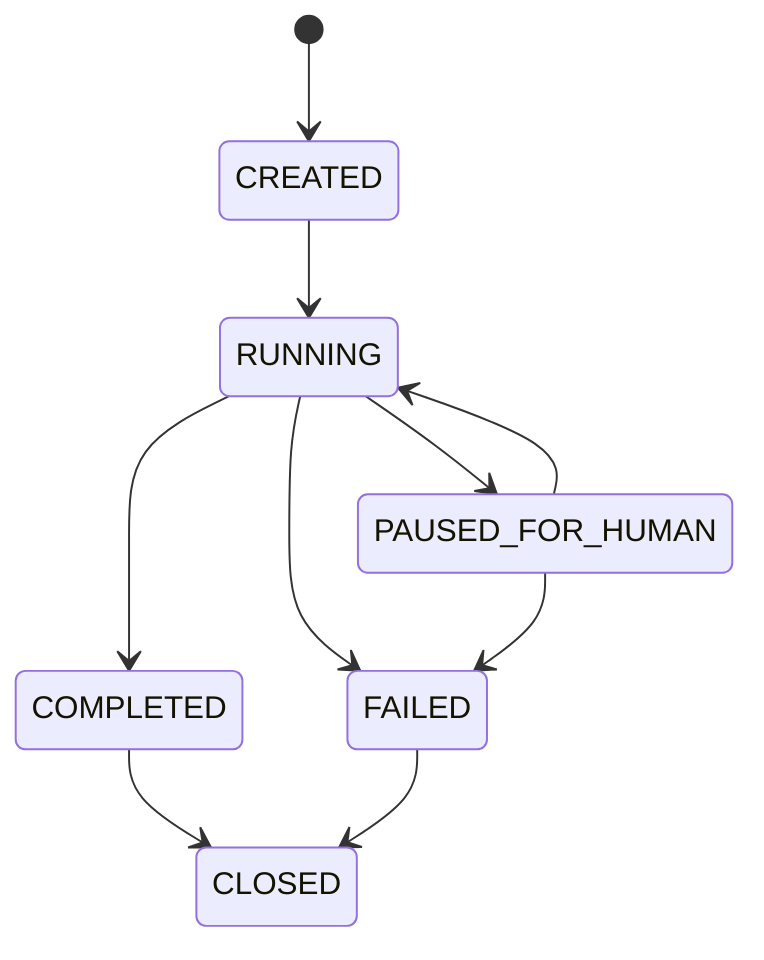

# Design report

## Architecture

The submitted reference capability is `prepare_savings_subaccount`. Its task identifier maps to a
specific natural-language goal: prepare a savings-subaccount request and stop at the verified review
screen. This is a deliberately scoped implementation of the discovery-to-replay pattern, not an
arbitrary universal task runner.

The model boundary is narrow. One OpenAI Agents SDK agent participates only in discovery, where it
receives sanitized semantic observations and chooses among six closed tools. Deterministic code owns
input resolution, policy, recording, completion validation, compilation, replay, outcomes, evidence,
and handoff. The successful trajectory becomes compiler input; the compiler verifies it and emits a
canonical artifact; replay later interprets that artifact without a model or discovery fallback.

Playwright is private behind `SurfaceAdapter`. Discovery and replay can observe semantic state or
request bounded click, fill, selection, and same-origin navigation operations, but cannot access a
browser, page, locator, selector, or script primitive. This keeps browser authority in application
code and gives another surface implementation a stable contract to satisfy.

## Artifact schema

The v1 schema makes the capability reviewable before execution. It contains identity and semantic
version, DRAFT lifecycle state, typed inputs and outputs, preconditions, twelve ordered steps,
ordered semantic target strategies, expected page states, per-step timeouts, bounded recovery rules,
declared business outcomes, a success checkpoint, postconditions, ownership/risk requirements,
provenance, and adapter compatibility.

The artifact excludes the raw model transcript, CSS/XPath selectors, observation IDs, ephemeral
element references, Playwright handles, credentials, and resolved invocation values. Those details
either create unnecessary disclosure or are valid only inside one observation. Targets instead use
operator-visible semantics such as role, accessible name, label, trusted control ID, and page state,
with an exact-match count and fail-closed ambiguity policy.

Compilation accepts a verified successful discovery directory, validates its manifest and event
contract, projects only executed safe actions, and serializes canonical JSON. Existing versions
cannot be overwritten with different bytes. Compiler output is `DRAFT` with
`approvalRequired: true`; default replay rejects it. The demo's explicit `--allow-draft` flag is a
local acceptance aid, not approval and not a lifecycle mutation.

## Determinism & error handling

Replay validates the artifact and all declared inputs before browser execution. Each step takes a
fresh observation, checks the required page state, resolves its semantic target to exactly one live
control, rechecks ownership and risk, executes through `SurfaceAdapter`, and validates the resulting
state. Deterministic replay makes zero model calls and never falls back to discovery.

Results preserve four useful categories. A successful outcome means the final checkpoint proved
`READY_FOR_REVIEW` and `account_created: false`. A declared business outcome such as
`MEMBER_NOT_FOUND` is terminal and expected rather than an automation crash. Recoverable conditions
are limited to named stale-observation or transient-timeout cases on artifact-declared idempotent
fills and selections. Hard failures cover invalid artifacts or inputs, policy rejection, missing or
ambiguous targets, session loss, incompatible state, exhausted deadlines, and failed checkpoints.

The artifact supplies an aggregate runtime deadline and per-step deadlines. The effective bound is
the earlier of the two and reaches the actual Playwright operation. Retry counts are finite, and
clicks, policy failures, HUMAN/NONE controls, irreversible actions, and ambiguity never retry. This
prevents a timed-out operation from mutating the portal after replay has reported a terminal result.

## Heterogeneity & multi-tenant

The implemented surface is a local server-rendered web portal observed through Chromium's DOM and
accessibility semantics. `SurfaceAdapter` is the extension seam for desktop accessibility APIs or a
legacy UI normalization layer: the implementation may change, but observation identity, semantic
targets, ownership, risk, session identity, timeouts, and bounded actions must retain the same
contract. Raw desktop or browser automation would still remain outside model reach.

Compatibility fields identify application family, variant, semantic surface version, adapter kind,
and tenant scope. A production design could start from a reviewed base artifact and apply explicit,
schema-validated tenant, vendor, or UI-version overrides before approval. Runtime drift should cause
an exact semantic or page-state mismatch and fail closed, prompting review or rediscovery rather
than a silent selector patch.

This repository demonstrates one synthetic tenant and one web adapter. It does not prove real
cross-tenant deployment, canonicalization across vendors, or desktop support; those are designed
extension points that need separate evidence.

## Escalation & handoff

A HUMAN-owned identity page pauses the existing replay instead of starting another agent or browser.
The coordinator creates a high-entropy token, stores only its digest, and binds it to the run,
artifact hash and version, replay session, surface session, completed-step checkpoint, expected page
transition, and TTL. The browser remains open while the employee acts.

Resume validates that binding and performs a fresh observation in the same `ReplayEngine` and
`SurfaceAdapter` session. Completed artifact steps are not repeated. If the HUMAN gate remains, the
typed result is `HANDOFF_NOT_COMPLETED`; the token remains active and the CLI allows another
acknowledgement within the original TTL. Success requires the fresh observation to reach
`ready-for-review`. Expiry, EOF, Ctrl+C, binding mismatch, session change, or an unexpected page
fails closed.

The synthetic verification code is entered only by the evaluator in the browser. It is deliberately
absent from replay inputs, automated actions, events, summaries, and screenshots. A real code would
arrive through an out-of-band human channel.

## Safety

Every observed control has an owner—`AUTOMATION`, `HUMAN`, or `NONE`—and a risk classification—
`SAFE`, `SENSITIVE`, or `IRREVERSIBLE`. Missing or untrusted metadata defaults to the most
restrictive interpretation. Policy permits only allowlisted automation operations on suitable
controls and blocks external navigation, ambiguous matches, HUMAN/NONE ownership, and irreversible
risk.

The final **Open Account** button is `NONE`-owned and `IRREVERSIBLE`. It is present so the
checkpoint can prove both that review was reached and that the action was not executed. Input values
are resolved from vault references only at execution time. Evidence stores references, hashes, page
states, fingerprints, policy decisions, and typed outcomes—not credentials, resolved values, raw
tokens, verification codes, selectors, HTML, or provider messages. Screenshots mask form controls
and invocation-dependent values. SDK tracing is disabled, runtime evidence is ignored, and curated
evidence is redaction-tested and hash-manifested.

## Cuts

The optional work is intentionally represented at its actual maturity:

- Confidence/approval lifecycle: **partial**. DRAFT, `approvalRequired`, default rejection, and an
  explicit demo override exist; there is no signed approval service.
- Multi-run stability: **partial**. Deterministic tests and multiple successful runs exist, but
  there is no formal flakiness dashboard.
- Canonicalization/cross-tenant reuse: **designed, not demonstrated** across real tenants.
- Agent-facing capability catalog/API: **not implemented**.
- Bounded single-step LLM fallback: **not implemented**.
- Code generation: **not implemented**.
- Cross-process handoff recovery/full co-browsing: **not implemented**.

Production identity, remote secret storage, durable workflow infrastructure, signing, fleet
scheduling, and telemetry are also outside this local reference. They were cut in favor of a small,
auditable core that demonstrates the assignment's harder boundary: an LLM can discover a workflow,
but deterministic code controls approval, replay, recovery, evidence, human ownership, and every
irreversible-action decision.
